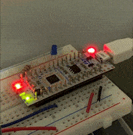

# stm32-simple-rtos
Developing a bare minimum RTOS (realtime operating system) kernel for STM32-L432 MCU by following the [YouTube video series](https://youtube.com/playlist?list=PLPW8O6W-1chwyTzI3BHwBLbGQoPFxPAPM) offered by Dr. Miro Samek.

Note: The above video series uses a different MCU and an IDE (with Clang compiler). However, most of the implementation should be very similar since the STM32-L432 MCU is also using the ARM Cortex-M4 CPU, as in those tutorials. I'm using the STM32 Cube IDE with GCC compiler for this project.
 
## Demo

 
Green and Blue LEDs are blinking independently with separate delays, 500ms and 1000ms, respectively. This behaviour is achieved by having a thread for each LED.